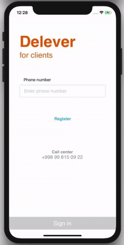

<h1 align="center">Appium Demo test </h1>

 

<h2 align="center"> Generated report </h2>

<h2 align="center"> Install the application </h2>

Application is located in the app folder   
To install run the following commands in the cli 

  
- yarn install   
- cd ios  
- pod install 

<h2 align="center"> Set up </h2>

- In the BaseClass change the UDID to the device connected    
- Build the app in the Xcode  
- Find the path to the .app file. Go to -> Products -> DeleverClient.app and copy the full path    
- In the BaseClass set the application path

